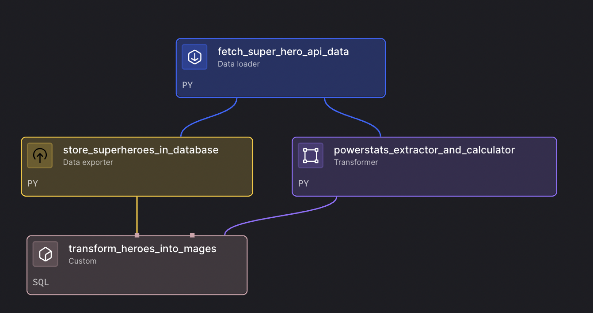

# Combine Python and SQL Pipeline

This pipeline demonstrates how to effectively combine Python data processing with SQL operations in Mage, showcasing the power of using both languages together for complex data transformations.

## Overview

The pipeline performs the following steps:
1. **Python Data Loading** - Load data using Python libraries (pandas, requests, etc.)
2. **SQL Transformation** - Apply complex transformations using SQL
3. **Python Post-processing** - Use Python for advanced analytics and ML operations
4. **Hybrid Export** - Combine SQL and Python for final data export

## Features

- **Hybrid Processing** - Seamlessly combine Python and SQL operations
- **Data Validation** - Use Python for data quality checks and SQL for data integrity
- **Advanced Analytics** - Leverage Python libraries (pandas, numpy, scipy) with SQL aggregations
- **Flexible Transformations** - Use SQL for complex joins and Python for custom logic
- **Performance Optimization** - Use SQL for large-scale operations and Python for detailed processing

## Use Cases

- **Complex Data Transformations** - When you need both SQL's power and Python's flexibility
- **Data Quality Pipeline** - SQL for data integrity, Python for anomaly detection
- **Analytics Workflows** - SQL for aggregations, Python for statistical analysis
- **ML Feature Engineering** - SQL for data preparation, Python for feature creation
- **Reporting Pipelines** - SQL for data extraction, Python for visualization

## Pipeline Architecture



The pipeline combines Python and SQL operations in a structured workflow, as shown in the dependency tree above. Each block represents a specific processing step that can be either Python-based or SQL-based, allowing for optimal performance and flexibility.

### Configuration

1. **Environment Variables (Optional):**
   ```env
   # API Configuration (if using external data)
   SUPERHERO_API_URL=https://cdn.jsdelivr.net/gh/akabab/superhero-api@0.3.0/api/all.json
   ```

2. **IO Configuration (`io_config.yaml`):**
   ```yaml
   default:
     DUCKDB_CONNECT_TIMEOUT: 10
     DUCKDB_DATABASE: "examples.db"
   ```

## Pipeline Components

### 1. Python Data Loader
- Loads customer data from API or CSV files
- Performs data cleaning and type conversion
- Handles missing values and data validation

### 2. SQL Transformer
- Complex joins between customers and orders tables
- Customer segmentation based on spending patterns
- Aggregations and calculations using SQL functions

### 3. Python Post-processor
- Statistical analysis using scipy and numpy
- Customer lifetime value predictions
- Anomaly detection algorithms

### 4. Hybrid Exporter
- Exports results to database using SQL
- Generates summary reports using Python
- Combines both approaches for optimal performance

## Usage

1. **Import the Pipeline:**
   ```bash
   # Create zip file
   cd examples/batch-etl/combine_python_and_sql
   zip -r superhero-analysis-pipeline.zip .
   
   # Upload to Mage UI
   # Go to Pipelines → Import → Upload zip file
   ```

2. **Run the Pipeline:**
   - Open the pipeline in Mage UI
   - Click "Run" to execute
   - Monitor execution in real-time
   - The pipeline will automatically fetch superhero data from the API

3. **View Results:**
   - Check the `superheroes` table in DuckDB
   - Review the power statistics and statistical analysis
   - Explore the processed superhero data

4. **Analyze the Data:**
   - Use SQL queries to explore the superhero data
   - Analyze power statistics and rankings
   - Compare different superhero attributes

## Performance Tips

1. **Use SQL for Large Operations:**
   - Joins, aggregations, and filtering
   - Data type conversions
   - Complex calculations

2. **Use Python for Advanced Analytics:**
   - Statistical analysis
   - Machine learning operations
   - Custom business logic
   - Data visualization

3. **Optimize Data Flow:**
   - Minimize data movement between SQL and Python
   - Use appropriate data types
   - Implement proper indexing

## Troubleshooting

**SQL Connection Issues:**
- Verify database credentials in `io_config.yaml`
- Check network connectivity
- Ensure database is running

**Python Import Errors:**
- Install required packages: `pip install -r requirements.txt`
- Check Python version compatibility
- Verify virtual environment

**Performance Issues:**
- Optimize SQL queries
- Use appropriate data types
- Consider data partitioning for large datasets

## Dependencies

Mage includes all required packages by default:
- pandas (for data processing)
- requests (for API calls)
- duckdb (for database operations)