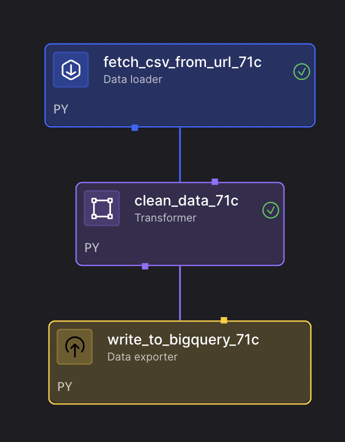

# CSV Processing Pipeline

This pipeline demonstrates how to process CSV files in Mage, from fetching data from URLs to cleaning and exporting to BigQuery. It uses the Titanic dataset as an example but can be adapted for any CSV data source.

## Overview

The pipeline performs the following steps:
1. **CSV Data Loading** - Fetch CSV data from a URL using Python requests
2. **Data Cleaning** - Clean and standardize the data using pandas
3. **Data Export** - Export cleaned data to BigQuery for analysis

## Features

- **URL-based CSV Loading** - Fetch CSV files directly from web URLs
- **Comprehensive Data Cleaning** - Remove nulls, standardize text, convert data types
- **BigQuery Integration** - Export processed data to Google BigQuery
- **Flexible Configuration** - Customizable CSV URLs and BigQuery destinations
- **Data Validation** - Automatic data type conversion and duplicate removal

## Use Cases

- **Data Pipeline Tutorial** - Learn ETL principles with real-world data
- **CSV Data Processing** - Process CSV files from various sources
- **Data Warehousing** - Load cleaned data into BigQuery for analytics
- **Data Quality Pipeline** - Standardize and clean raw CSV data
- **Batch Processing** - Process large CSV files in batches

## Pipeline Architecture



The pipeline follows a simple ETL pattern, fetching CSV data from URLs, cleaning and standardizing the data, and exporting it to BigQuery for analysis, as shown in the dependency tree above.

## Setup

### Prerequisites
- Google Cloud Platform account with BigQuery enabled
- BigQuery service account credentials
- Mage with BigQuery integration

### Configuration

1. **Environment Variables:**
   ```env
   # Google Cloud Configuration
   GOOGLE_APPLICATION_CREDENTIALS=/path/to/your/service-account-key.json
   GCP_PROJECT_ID=your-project-id
   ```

2. **IO Configuration (`io_config.yaml`):**
   ```yaml
   default:
     GOOGLE_SERVICE_ACC_KEY_FILEPATH: "{{ env_var('GOOGLE_APPLICATION_CREDENTIALS') }}"
     GOOGLE_LOCATION: "US"
   ```

3. **Update BigQuery Table ID:**
   ```python
   # In write_to_bigquery_71c.py, update the table_id:
   table_id = 'your-project.your_dataset.your_table_name'
   ```

## Pipeline Components

### 1. Data Loader - Fetch CSV from URL
- Fetches CSV data from a specified URL (defaults to Titanic dataset)
- Uses requests library to download the CSV content
- Loads data into pandas DataFrame for processing
- Handles HTTP errors and network issues

### 2. Transformer - Clean Data
- **Removes null values** - Drops rows with any null values
- **Standardizes text** - Strips whitespace and converts to lowercase
- **Converts data types** - Attempts to convert columns to appropriate numeric types
- **Removes duplicates** - Eliminates duplicate rows
- **Preserves original types** - Maintains data type integrity where possible

### 3. Data Exporter - Write to BigQuery
- Exports cleaned data to Google BigQuery
- Uses replace mode to overwrite existing data
- Configurable table ID and dataset
- Handles BigQuery authentication and permissions

## Sample Data

The pipeline processes the Titanic dataset by default, which includes:
- **Passenger Information** - Name, age, sex, ticket class
- **Travel Details** - Fare, cabin, embarked port
- **Survival Data** - Whether the passenger survived
- **Family Information** - Number of siblings, spouses, parents, children

## Usage

1. **Import the Pipeline:**
   ```bash
   # Create zip file
   cd examples/batch-etl/csv_processing
   zip -r csv-processing-pipeline.zip .
   
   # Upload to Mage UI
   # Go to Pipelines → Import → Upload zip file
   ```

2. **Configure BigQuery:**
   - Set up Google Cloud credentials
   - Update the table ID in the exporter
   - Configure your project and dataset

3. **Run the Pipeline:**
   - Open the pipeline in Mage UI
   - Click "Run" to execute
   - Monitor execution in real-time

4. **View Results:**
   - Check your BigQuery table for the processed data
   - Verify data quality and completeness
   - Run analytics queries on the cleaned data

## Customization

### Using Different CSV Sources
```python
# In fetch_csv_from_url_71c.py, change the URL:
url = "https://your-data-source.com/your-file.csv"
```

### Modifying Data Cleaning Logic
```python
# In clean_data_71c.py, add custom cleaning rules:
# Example: Remove rows where age < 0
data_cleaned = data_cleaned[data_cleaned['age'] >= 0]
```

### Changing Export Destination
```python
# In write_to_bigquery_71c.py, update table configuration:
table_id = 'your-project.your_dataset.your_table_name'
```

## Performance Tips

1. **Large CSV Files:**
   - Consider chunking for very large files
   - Use appropriate data types to reduce memory usage
   - Monitor memory consumption during processing

2. **Data Cleaning:**
   - Apply cleaning rules in order of importance
   - Use vectorized pandas operations for better performance
   - Consider parallel processing for large datasets

3. **BigQuery Export:**
   - Use appropriate table partitioning for large datasets
   - Consider clustering for frequently queried columns
   - Monitor BigQuery quotas and costs

## Troubleshooting

**CSV Loading Issues:**
- Verify the CSV URL is accessible
- Check network connectivity
- Ensure the CSV format is valid

**Data Cleaning Errors:**
- Review data types and formats
- Check for encoding issues
- Validate data quality before cleaning

**BigQuery Export Issues:**
- Verify Google Cloud credentials
- Check BigQuery permissions
- Ensure table ID format is correct
- Monitor BigQuery quotas

## Dependencies

Mage includes all required packages by default:
- pandas (for data processing)
- requests (for HTTP requests)
- google-cloud-bigquery (for BigQuery integration)

## Learning Outcomes

After running this pipeline, you'll understand:
- How to fetch CSV data from URLs
- Data cleaning and standardization techniques
- BigQuery integration and data warehousing
- ETL pipeline design principles
- Data quality and validation practices
