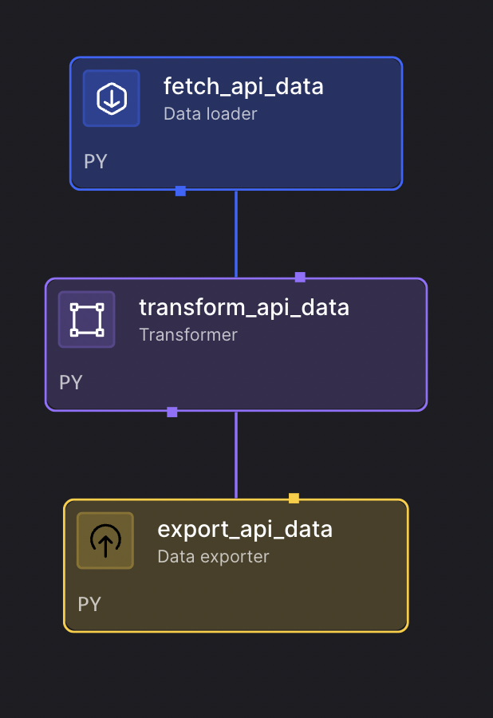

# Transform API Data Pipeline

This pipeline demonstrates how to fetch data from APIs and transform it for analysis in Mage. It processes medical data to calculate cardiac risk scores and categorize patients by risk level.

## Overview

The pipeline performs the following steps:
1. **API Data Loading** - Fetch medical data from a CSV API endpoint
2. **Data Transformation** - Calculate cardiac risk scores and categorize patients
3. **Data Export** - Export processed data for further analysis

## Features

- **API Data Fetching** - Fetch CSV data directly from web APIs
- **Risk Score Calculation** - Calculate comprehensive cardiac risk scores
- **Risk Categorization** - Categorize patients into Low, Medium, and High risk groups
- **Data Validation** - Handle missing values and data quality issues
- **Flexible Export** - Export processed data for analysis and reporting

## Use Cases

- **Medical Data Analysis** - Process patient data for risk assessment
- **API Data Processing** - Transform data from external APIs
- **Risk Assessment Pipeline** - Calculate and categorize risk scores
- **Data Pipeline Tutorial** - Learn ETL principles with real-world data
- **Healthcare Analytics** - Support clinical decision-making processes

## Pipeline Architecture



The pipeline fetches medical data from an API, calculates cardiac risk scores, and categorizes patients by risk level, as shown in the dependency tree above.

## Setup

### Prerequisites
- Mage with API access capabilities
- Internet connection for API data fetching

### Configuration

1. **Environment Variables (Optional):**
   ```env
   # API Configuration
   MEDICAL_DATA_API_URL=https://raw.githubusercontent.com/mage-ai/datasets/refs/heads/master/medical.csv
   ```

2. **IO Configuration (`io_config.yaml`):**
   ```yaml
   default:
     # No special configuration required for this pipeline
   ```

## Pipeline Components

### 1. Data Loader - Fetch API Data
- Fetches medical data from a CSV API endpoint
- Uses requests library to download the data
- Loads data into pandas DataFrame for processing
- Handles HTTP errors and network issues

### 2. Transformer - Transform API Data
- **Calculates Cardiac Risk Score** - Sums up individual risk factors:
  - Age score
  - Blood pressure score
  - Pulse score
  - BMI score
- **Risk Categorization** - Assigns risk categories based on total score:
  - **Low Risk** (score ≤ 1)
  - **Medium Risk** (score 2-3)
  - **High Risk** (score ≥ 4)
- **Data Quality** - Handles missing values and data validation

### 3. Data Exporter - Export API Data
- Exports processed data for further analysis
- Returns the transformed dataset
- Can be customized for specific export destinations

## Sample Data

The pipeline processes medical data including:
- **Patient Demographics** - Age, gender, and basic information
- **Vital Signs** - Blood pressure, pulse, BMI measurements
- **Risk Factors** - Individual risk scores for various health metrics
- **Calculated Metrics** - Cardiac risk scores and risk categories

## Usage

1. **Import the Pipeline:**
   ```bash
   # Create zip file
   cd examples/batch-etl/transform_api_data
   zip -r transform-api-data-pipeline.zip .
   
   # Upload to Mage UI
   # Go to Pipelines → Import → Upload zip file
   ```

2. **Run the Pipeline:**
   - Open the pipeline in Mage UI
   - Click "Run" to execute
   - Monitor execution in real-time
   - The pipeline will automatically fetch medical data from the API

3. **View Results:**
   - Check the processed data in the transformer output
   - Review the cardiac risk scores and categories
   - Analyze the risk distribution across patients

4. **Analyze the Data:**
   - Use the risk categories for patient stratification
   - Identify high-risk patients for intervention
   - Generate reports and insights

## Customization

### Using Different API Sources
```python
# In fetch_api_data.py, change the URL:
url = "https://your-api-endpoint.com/your-data.csv"
```

### Modifying Risk Calculation Logic
```python
# In transform_api_data.py, adjust risk factors:
data['cardiac_risk_score'] = (
    data['age_score'].fillna(0) * 2 +  # Weight age more heavily
    data['bp_score'].fillna(0) +
    data['pulse_score'].fillna(0) +
    data['bmi_score'].fillna(0)
)
```

### Changing Risk Categories
```python
# In transform_api_data.py, modify risk thresholds:
def assign_risk_category(score: int) -> str:
    if score <= 2:
        return 'Low risk'
    elif 3 <= score <= 5:
        return 'Medium risk'
    elif score >= 6:
        return 'High risk'
    return 'Unknown'
```

### Custom Export Destination
```python
# In export_api_data.py, add specific export logic:
@data_exporter
def export_data(data, *args, **kwargs):
    # Export to database, file, or another system
    data.to_csv('processed_medical_data.csv', index=False)
    return data
```

## Performance Tips

1. **API Data Fetching:**
   - Monitor API rate limits and response times
   - Consider caching for frequently accessed data
   - Handle network timeouts gracefully

2. **Data Processing:**
   - Use vectorized pandas operations for better performance
   - Optimize risk calculation logic
   - Consider parallel processing for large datasets

3. **Memory Management:**
   - Monitor memory usage with large datasets
   - Use appropriate data types to reduce memory footprint
   - Consider chunking for very large datasets

## Troubleshooting

**API Connection Issues:**
- Verify the API endpoint is accessible
- Check network connectivity
- Ensure the API returns valid CSV data

**Data Processing Errors:**
- Review data types and formats
- Check for missing values in risk score columns
- Validate risk calculation logic

**Export Issues:**
- Verify export destination is accessible
- Check file permissions and disk space
- Ensure data format compatibility

## Dependencies

Mage includes all required packages by default:
- pandas (for data processing)
- requests (for API calls)

## Learning Outcomes

After running this pipeline, you'll understand:
- How to fetch data from APIs using Python
- Data transformation and calculation techniques
- Risk assessment and categorization methods
- ETL pipeline design principles
- Medical data processing workflows
