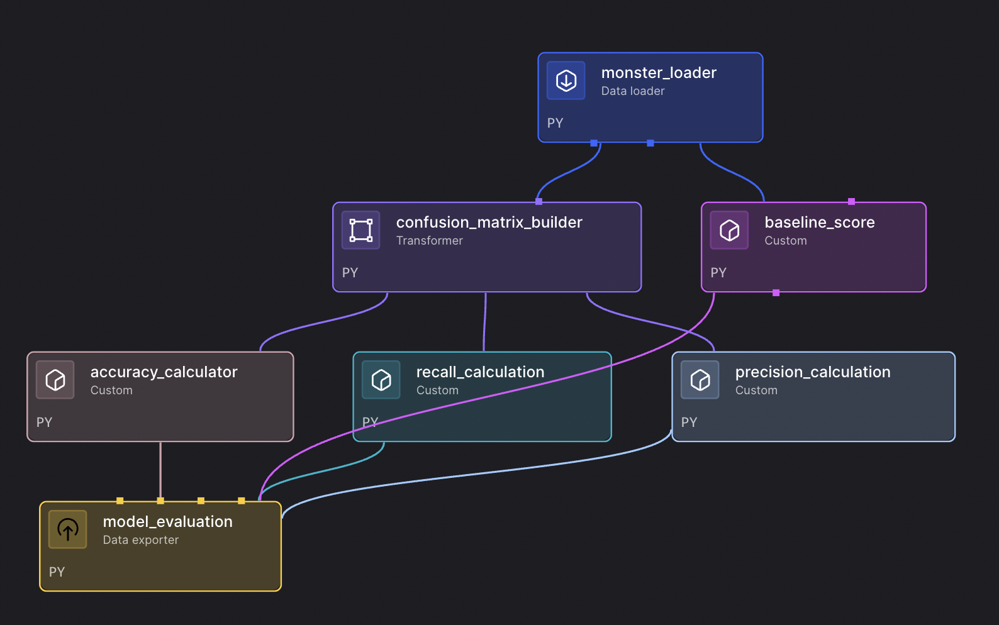

# Guide to Accuracy, Precision, and Recall Pipeline

This pipeline demonstrates how to calculate and interpret key machine learning evaluation metrics: accuracy, precision, and recall. It uses a fun monster weakness prediction example to make these concepts clear and practical.

## Overview

The pipeline performs the following steps:
1. **Data Loading** - Load sample monster weakness data with true labels and predictions
2. **Confusion Matrix** - Build a confusion matrix from the predictions
3. **Metric Calculations** - Calculate accuracy, precision, and recall metrics
4. **Model Evaluation** - Compare model performance against baseline and generate comprehensive evaluation

## Features

- **Educational Focus** - Clear demonstration of ML evaluation metrics
- **Confusion Matrix Analysis** - Visual representation of prediction accuracy
- **Comprehensive Metrics** - Accuracy, precision, recall, and F1-score calculations
- **Baseline Comparison** - Compare model performance against simple baseline
- **Multiple Scenarios** - Different evaluation scenarios for various use cases

## Use Cases

- **ML Education** - Learn fundamental evaluation metrics
- **Model Assessment** - Evaluate classification model performance
- **Metric Comparison** - Compare different models using standard metrics
- **Baseline Establishment** - Set performance baselines for new models
- **Evaluation Framework** - Template for model evaluation pipelines

## Pipeline Architecture



The pipeline processes monster weakness predictions, builds a confusion matrix, and calculates comprehensive evaluation metrics, as shown in the dependency tree above.

## Setup

### Prerequisites
- Mage with machine learning capabilities
- Basic understanding of classification metrics

### Configuration

1. **IO Configuration (`io_config.yaml`):**
   ```yaml
   default:
     # No special configuration required for this pipeline
   ```

## Pipeline Components

### 1. Data Loader - Monster Loader
- Loads sample monster weakness data
- Contains true weakness labels and model predictions
- Includes 10 monsters with 3 weakness types: fire, water, wind
- Provides realistic prediction scenarios for evaluation

### 2. Transformer - Confusion Matrix Builder
- **Builds Confusion Matrix** - Creates matrix showing prediction accuracy
- **Element Mapping** - Maps weakness types to matrix indices
- **Count Tracking** - Counts correct and incorrect predictions
- **Matrix Structure** - Returns confusion matrix and element labels

### 3. Custom Blocks - Metric Calculations

#### Accuracy Calculator
- **Overall Accuracy** - Calculates percentage of correct predictions
- **Diagonal Sum** - Sums correct predictions (diagonal elements)
- **Total Predictions** - Divides by total number of predictions

#### Precision Calculation
- **Per-Class Precision** - Calculates precision for each weakness type
- **True Positives** - Counts correct predictions for each class
- **False Positives** - Handles division by zero cases
- **Class-Specific Metrics** - Returns precision for fire, water, and wind

#### Recall Calculation
- **Per-Class Recall** - Calculates recall for each weakness type
- **True Positives** - Counts correct predictions for each class
- **False Negatives** - Handles division by zero cases
- **Class-Specific Metrics** - Returns recall for fire, water, and wind

#### Baseline Score
- **Mode Calculation** - Finds most common weakness type
- **Baseline Accuracy** - Calculates accuracy of always predicting the mode
- **Performance Comparison** - Provides reference point for model evaluation

### 4. Data Exporter - Model Evaluation
- **Comprehensive Evaluation** - Combines all metrics into single output
- **F1-Score Calculation** - Calculates harmonic mean of precision and recall
- **Baseline Comparison** - Shows improvement over baseline
- **Scenario Analysis** - Provides different evaluation perspectives

## Sample Data

The pipeline uses monster weakness prediction data:
- **Monster Types** - 10 different monsters
- **Weakness Types** - Fire, water, wind (3 classes)
- **True Labels** - Actual monster weaknesses
- **Predictions** - Model predictions for each monster
- **Evaluation Scenario** - Realistic prediction errors for learning

## Usage

1. **Import the Pipeline:**
   ```bash
   # Create zip file
   cd examples/ml-models/guide_to_accuracy__precision__and_recall
   zip -r ml-evaluation-pipeline.zip .
   
   # Upload to Mage UI
   # Go to Pipelines → Import → Upload zip file
   ```

2. **Run the Pipeline:**
   - Open the pipeline in Mage UI
   - Click "Run" to execute
   - Monitor execution in real-time
   - Review the confusion matrix and metrics

3. **Analyze Results:**
   - Examine the confusion matrix structure
   - Review accuracy, precision, and recall values
   - Compare model performance against baseline
   - Analyze F1-scores for each class

4. **Learn from Metrics:**
   - Understand what each metric tells you
   - Identify which classes perform best/worst
   - Consider trade-offs between precision and recall

## Understanding the Metrics

### Accuracy
- **Definition** - Percentage of correct predictions overall
- **Formula** - (True Positives + True Negatives) / Total Predictions
- **Use Case** - Overall model performance when classes are balanced

### Precision
- **Definition** - Percentage of positive predictions that are correct
- **Formula** - True Positives / (True Positives + False Positives)
- **Use Case** - When false positives are costly (e.g., spam detection)

### Recall
- **Definition** - Percentage of actual positives correctly identified
- **Formula** - True Positives / (True Positives + False Negatives)
- **Use Case** - When false negatives are costly (e.g., disease detection)

### F1-Score
- **Definition** - Harmonic mean of precision and recall
- **Formula** - 2 × (Precision × Recall) / (Precision + Recall)
- **Use Case** - Balanced metric when both precision and recall matter

## Customization

### Using Different Data
```python
# In monster_loader.py, modify the sample data:
data = {
    'monster_id': range(1, 21),  # More monsters
    'true_weakness': ['fire', 'water', 'wind', 'earth', ...],  # More classes
    'predicted_weakness': ['fire', 'water', 'fire', 'earth', ...]
}
```

### Adding New Metrics
```python
# Create new custom block for additional metrics:
@custom
def main(confusion_matrix_: Dict[str, np.ndarray], **kwargs) -> Dict[str, float]:
    # Calculate additional metrics like specificity, sensitivity
    return metrics
```

### Modifying Evaluation Logic
```python
# In model_evaluation.py, add custom evaluation scenarios:
model_evaluation['custom_scenario'] = {
    'weighted_accuracy': calculate_weighted_accuracy(),
    'macro_average': calculate_macro_average()
}
```

## Performance Tips

1. **Confusion Matrix:**
   - Use numpy arrays for efficient matrix operations
   - Handle edge cases (division by zero)
   - Optimize for large number of classes

2. **Metric Calculations:**
   - Vectorize operations where possible
   - Cache intermediate calculations
   - Use appropriate data types

3. **Memory Management:**
   - Monitor memory usage with large confusion matrices
   - Consider sparse matrices for high-dimensional data
   - Optimize data structures for your use case

## Troubleshooting

**Confusion Matrix Issues:**
- Verify data types and formats
- Check for missing values in predictions
- Ensure consistent class labels

**Metric Calculation Errors:**
- Handle division by zero cases
- Validate input data ranges
- Check for NaN or infinite values

**Performance Issues:**
- Optimize matrix operations
- Use appropriate data types
- Consider parallel processing for large datasets

## Dependencies

Mage includes all required packages by default:
- pandas (for data processing)
- numpy (for mathematical operations)

## Learning Outcomes

After running this pipeline, you'll understand:
- How to build and interpret confusion matrices
- The differences between accuracy, precision, and recall
- When to use each metric for model evaluation
- How to calculate F1-scores and other derived metrics
- How to establish and compare against baselines
- Best practices for ML model evaluation

## Next Steps

- Apply these metrics to your own classification models
- Experiment with different evaluation scenarios
- Learn about additional metrics (ROC-AUC, PR-AUC, etc.)
- Explore advanced evaluation techniques
- Build evaluation pipelines for production models
