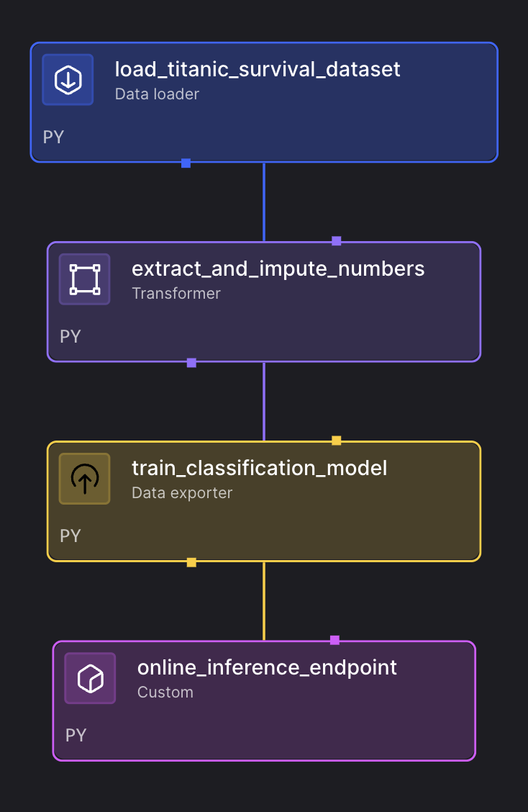

# ML Model Training Pipeline

This pipeline demonstrates a complete machine learning workflow for training a classification model. It uses the famous Titanic dataset to predict passenger survival, showcasing data loading, preprocessing, model training, and inference capabilities.

## Overview

The pipeline performs the following steps:
1. **Data Loading** - Fetch Titanic survival dataset from API
2. **Data Preprocessing** - Handle missing values and feature selection
3. **Model Training** - Train a logistic regression classifier
4. **Model Evaluation** - Evaluate model performance with accuracy metrics
5. **Inference Endpoint** - Create an online inference endpoint for predictions

## Features

- **Complete ML Workflow** - End-to-end machine learning pipeline
- **Data Validation** - Built-in tests for data quality and model performance
- **Missing Value Handling** - Automatic imputation using median strategy
- **Model Training** - Logistic regression with train/test split
- **Online Inference** - Real-time prediction endpoint
- **Performance Monitoring** - Accuracy tracking and minimum threshold enforcement

## Use Cases

- **ML Education** - Learn complete machine learning pipeline development
- **Classification Models** - Template for binary classification problems
- **Data Preprocessing** - Learn feature selection and imputation techniques
- **Model Deployment** - Understand model training and inference patterns
- **Production ML** - Foundation for production machine learning systems

## Pipeline Architecture



The pipeline processes Titanic data, trains a survival prediction model, and provides inference capabilities, as shown in the dependency tree above.

## Setup

### Prerequisites
- Mage with machine learning capabilities
- Internet connection for data fetching

### Configuration

1. **IO Configuration (`io_config.yaml`):**
   ```yaml
   default:
     # No special configuration required for this pipeline
   ```

## Pipeline Components

### 1. Data Loader - Load Titanic Survival Dataset
- **API Data Fetching** - Downloads Titanic dataset from GitHub
- **Data Validation** - Ensures minimum 891 rows and 12 columns
- **Quality Checks** - Built-in tests for data integrity
- **CSV Processing** - Loads data into pandas DataFrame

### 2. Transformer - Extract and Impute Numbers
- **Feature Selection** - Selects relevant numeric features:
  - Age, Fare, Parch, Pclass, SibSp, Survived
- **Missing Value Imputation** - Uses median imputation strategy
- **Data Preprocessing** - Handles NaN values automatically
- **Imputer Persistence** - Returns fitted imputer for inference

### 3. Data Exporter - Train Classification Model
- **Train/Test Split** - Splits data for model training and evaluation
- **Model Training** - Trains logistic regression classifier
- **Performance Evaluation** - Calculates accuracy score
- **Quality Assurance** - Enforces minimum accuracy threshold (0.5)
- **Model Persistence** - Returns trained model and imputer

### 4. Custom Block - Online Inference Endpoint
- **Real-time Predictions** - Provides inference endpoint for new data
- **Feature Processing** - Applies same preprocessing as training
- **Model Scoring** - Uses trained model for predictions
- **Input Validation** - Handles missing or invalid inputs

## Sample Data

The pipeline uses the Titanic survival dataset:
- **Passenger Information** - Age, fare, family size, ticket class
- **Survival Labels** - Binary classification (survived/did not survive)
- **Feature Engineering** - Numeric features for model training
- **Real-world Data** - Historical dataset with known outcomes

## Usage

1. **Import the Pipeline:**
   ```bash
   # Create zip file
   cd examples/ml-models/ml_model_training
   zip -r ml-training-pipeline.zip .
   
   # Upload to Mage UI
   # Go to Pipelines → Import → Upload zip file
   ```

2. **Run the Pipeline:**
   - Open the pipeline in Mage UI
   - Click "Run" to execute
   - Monitor training progress and accuracy
   - Review model performance metrics

3. **Test the Model:**
   - Use the inference endpoint to make predictions
   - Test with sample passenger data
   - Verify prediction accuracy

4. **Analyze Results:**
   - Review model accuracy and performance
   - Understand feature importance
   - Identify areas for improvement

## Model Training Details

### Features Used
- **Age** - Passenger age
- **Fare** - Ticket fare amount
- **Parch** - Number of parents/children aboard
- **Pclass** - Ticket class (1st, 2nd, 3rd)
- **SibSp** - Number of siblings/spouses aboard

### Model Configuration
- **Algorithm** - Logistic Regression
- **Train/Test Split** - Default sklearn split (75%/25%)
- **Imputation Strategy** - Median imputation for missing values
- **Performance Threshold** - Minimum 50% accuracy required

### Evaluation Metrics
- **Primary Metric** - Accuracy score
- **Validation** - Built-in test for minimum performance
- **Quality Assurance** - Pipeline fails if accuracy < 0.5

## Inference Usage

### Making Predictions
```python
# Example inference call
prediction = score(
    training_output,
    Age=25,
    Fare=50.0,
    Parch=0,
    Pclass=2,
    SibSp=1
)
```

### Input Parameters
- **Age** - Passenger age (numeric)
- **Fare** - Ticket fare (numeric)
- **Parch** - Parents/children count (integer)
- **Pclass** - Ticket class (1, 2, or 3)
- **SibSp** - Siblings/spouses count (integer)

## Customization

### Using Different Datasets
```python
# In load_titanic_survival_dataset.py, change the URL:
url = 'https://your-dataset-url.com/your-data.csv'
```

### Modifying Features
```python
# In extract_and_impute_numbers.py, select different features:
df = df[['feature1', 'feature2', 'feature3', 'target']]
```

### Changing Model Algorithm
```python
# In train_classification_model.py, use different model:
from sklearn.ensemble import RandomForestClassifier
model = RandomForestClassifier(n_estimators=100)
```

### Adjusting Performance Threshold
```python
# In train_classification_model.py, modify minimum score:
minimum_score = 0.7  # Require 70% accuracy
```

## Performance Tips

1. **Data Preprocessing:**
   - Use appropriate imputation strategies
   - Consider feature engineering
   - Validate data quality early

2. **Model Training:**
   - Tune hyperparameters for better performance
   - Use cross-validation for robust evaluation
   - Consider ensemble methods

3. **Inference:**
   - Cache preprocessed features
   - Optimize prediction latency
   - Handle edge cases gracefully

## Troubleshooting

**Data Loading Issues:**
- Verify API endpoint accessibility
- Check network connectivity
- Ensure CSV format compatibility

**Model Training Errors:**
- Review feature selection and data types
- Check for sufficient training data
- Validate target variable distribution

**Inference Problems:**
- Verify input feature format
- Check for missing required features
- Ensure model and imputer compatibility

**Performance Issues:**
- Monitor memory usage during training
- Optimize feature preprocessing
- Consider model complexity trade-offs

## Dependencies

Mage includes all required packages by default:
- pandas (for data processing)
- numpy (for numerical operations)
- scikit-learn (for machine learning)
- requests (for API calls)

## Learning Outcomes

After running this pipeline, you'll understand:
- How to build complete ML training pipelines
- Data preprocessing and feature engineering techniques
- Model training and evaluation best practices
- Online inference endpoint development
- Data validation and quality assurance
- Production ML pipeline patterns

## Next Steps

- Experiment with different algorithms and hyperparameters
- Add more sophisticated feature engineering
- Implement cross-validation and model selection
- Deploy the model to production environments
- Add monitoring and logging capabilities
- Explore advanced ML techniques and frameworks
